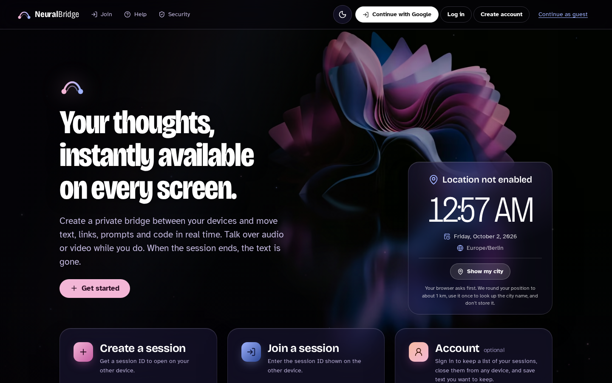
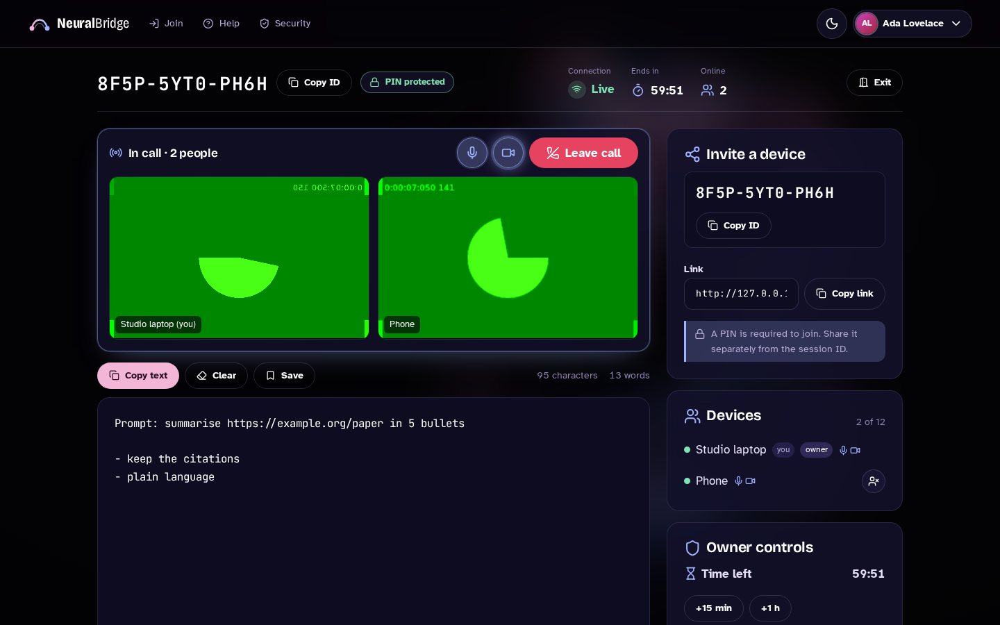
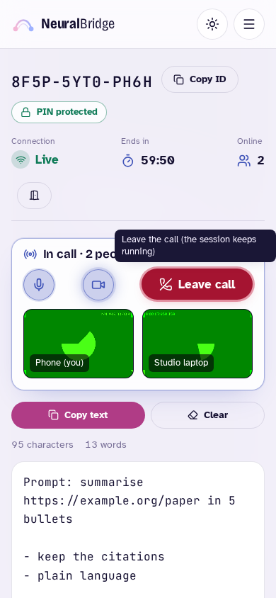
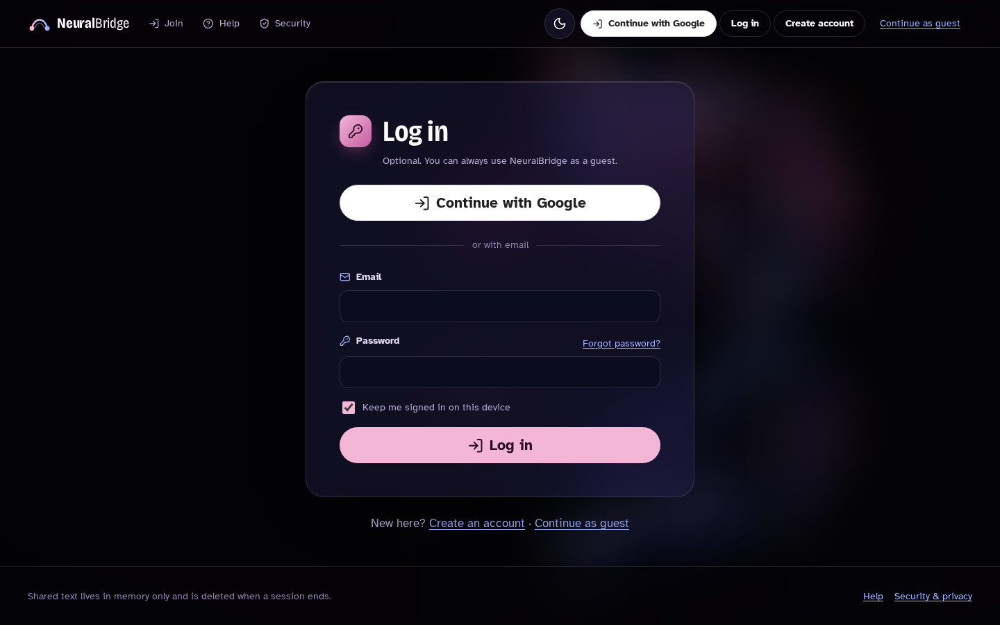
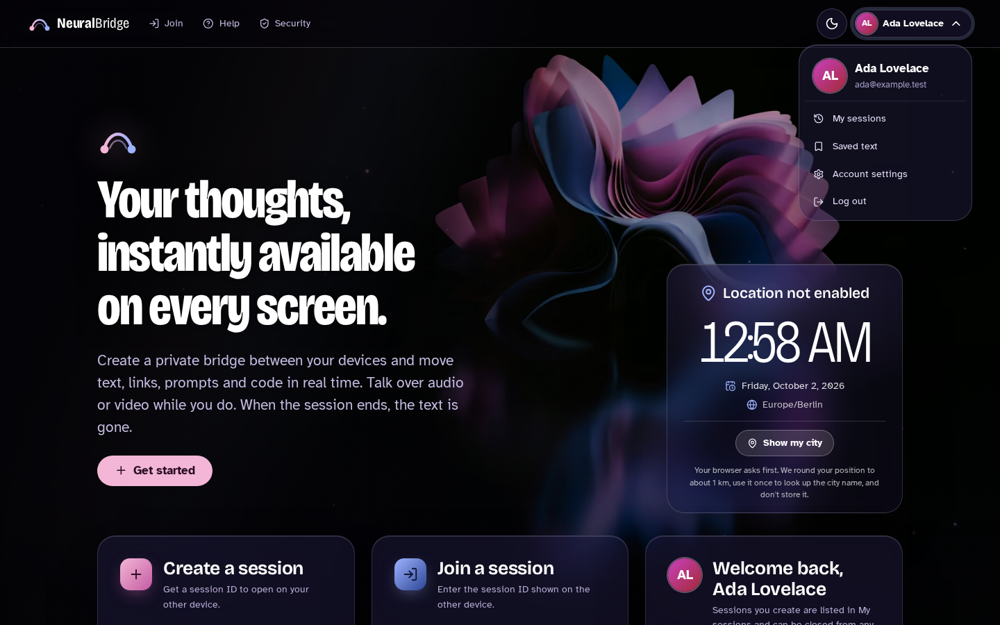
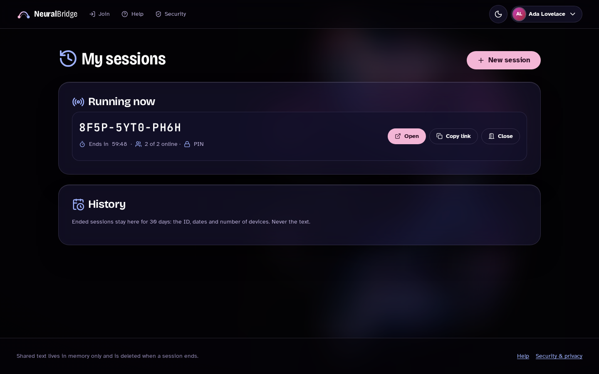

# NeuralBridge

A secure, real-time text bridge between your devices. Open a temporary session on one
computer, join it from another with a 12-character session ID, and everything you type or paste
(text, links, prompts, code) appears on every connected screen. When the session closes or
expires, the text is gone.

NeuralBridge is **not** remote desktop. It never transmits your screen, never controls
another computer, never reads the clipboard in the background and never captures keystrokes
outside its own editor.



| Workspace with a video call (signed in) | Guest on a phone (light theme) |
|---|---|
|  |  |

| Log in | Account menu | My sessions |
|---|---|---|
|  |  |  |

The screenshots use Chromium's fake camera (green test pattern) and the mock Google provider.

---

## Contents

1. [Features](#features)
2. [Prerequisites](#prerequisites)
3. [Quick start](#quick-start)
4. [Platform notes: macOS, Windows/Visual Studio, Linux, VS Code, Rider](#platform-notes)
5. [Configuration](#configuration) · [user secrets](#user-secrets) · [environment variables](#environment-variables)
6. [Database & migrations](#database--migrations)
7. [Google sign-in (optional)](#google-sign-in-optional) · [calls](#audio-and-video-calls)
8. [Tests](#tests) · [Playwright](#end-to-end-tests-playwright)
9. [Docker](#docker)
10. [Architecture](#architecture)
11. [Security & privacy](#security--privacy)
12. [Troubleshooting](#troubleshooting)
13. [Known limitations](#known-limitations) · [Roadmap](#roadmap)
14. [Screenshots](#producing-screenshots)

---

## Features

- **Guest sessions with no account.** One click creates a session with a CSPRNG join code (`7KQ4-M2XD-9PHT`) and a shareable link. Optional device name, optional PIN, and a lifetime of 15 min, 1 h (default), 8 h or 24 h.
- **Join by code or link** from any modern desktop or mobile browser. Friendly states for invalid, expired, closed, wrong PIN, full and connection-lost.
- **Real-time shared editor.** Edits are debounced in the browser (not one request per keystroke), last-write-wins with versioning, "someone is editing" indicator, character and word counts, last-synced time, automatic URL detection (links open only on click), clear with confirmation, and copy to clipboard on an explicit click.
- **Presence:** connected devices, online count and connection status, with automatic reconnect.
- **Owner controls:** close, extend (+15 min / +1 h, capped), remove a device, guest read-only mode, rotate the join code, require/change/remove a PIN.
- **Audio and video calls** inside a session: device-to-device WebRTC (mesh, up to 6 people by default) with mute, camera on/off, speaking indicators and leave; signaling is relayed only between members of the same session's call.
- **Optional accounts, never required.** *Continue with Google* (OAuth 2.0 authorization code + PKCE), or email and password with forgot/reset password. Signed-in users get an avatar menu, **My sessions** (running sessions plus history, if they keep it), **Saved** text, and **Account settings** (profile, connect/disconnect Google, password, history on/off, sign out everywhere, delete account). *Continue as guest* is always one click away.
- **Interface:** a full-screen wallpaper (the violet sculpture) with refraction, shimmer, particles, slow parallax and a readability gradient; frosted glass panels; one icon set (Lucide) with hover, focus, active, disabled and status states; local time and date, and the city only after you allow location.
- Dark and light themes, reduced-motion support, keyboard and touch accessible, responsive from 320 px.

## Prerequisites

| Tool | Version | Needed for |
|---|---|---|
| [.NET SDK](https://dotnet.microsoft.com/download) | **10.0** (LTS) | build & run |
| Node.js | 18+ (22 recommended) | Playwright end-to-end tests only |
| `dotnet-ef` | 10.x | generating migrations (optional) |
| Docker | 24+ | container run (optional) |

```bash
dotnet --version            # 10.0.x
dotnet tool install --global dotnet-ef   # optional
```

## Quick start

```bash
git clone <your-fork-url> neuralbridge && cd neuralbridge
dotnet restore
dotnet run --project src/NeuralBridge.Web --launch-profile https
```

Open https://localhost:7243. To test with two "devices", open a second browser or a
private window and join with the code shown in the first.

- The default provider is **SQLite** (`src/NeuralBridge.Web/data/neuralbridge.db`). The schema is created on first start.
- No Google credentials are needed. Account features stay hidden until you configure them.
- Trust the dev certificate once if your browser warns you: `dotnet dev-certs https --trust`.

**Try it from your phone on the same network:** run the `lan (other devices)` profile
(`dotnet run --project src/NeuralBridge.Web --launch-profile "lan (other devices)"`), then open
`http://<your-computer-ip>:5243` on the phone. Over plain HTTP, browsers block the async
Clipboard API, so NeuralBridge falls back to a legacy copy method. Use HTTPS for anything
sensitive.

**No database at all (demo mode):**

```bash
NeuralBridge__Persistence__Provider=InMemory dotnet run --project src/NeuralBridge.Web
```

## Platform notes

### macOS

```bash
brew install --cask dotnet-sdk        # or the installer from dot.net
dotnet dev-certs https --trust
dotnet run --project src/NeuralBridge.Web --launch-profile https
```

On Apple Silicon everything runs natively (arm64).

### Windows & Visual Studio 2022 (17.14+) / 2026

1. Install the **ASP.NET and web development** workload with the .NET 10 SDK.
2. Open `NeuralBridge.sln`, set **NeuralBridge.Web** as the startup project, pick the `https` profile, and press F5.
3. Test Explorer discovers `NeuralBridge.Tests` (xUnit).
4. For user secrets, right-click NeuralBridge.Web → **Manage User Secrets**.

From PowerShell:

```powershell
dotnet dev-certs https --trust
dotnet run --project src\NeuralBridge.Web --launch-profile https
```

### Linux

Install the .NET 10 SDK from your distribution or Microsoft's packages, then use the
quick-start commands. `dotnet dev-certs https --trust` is limited on Linux, so use the `http`
profile locally or trust the certificate manually.

### VS Code

Install the recommended extensions (`.vscode/extensions.json`: C# Dev Kit, Playwright,
EditorConfig), open the folder and run **NeuralBridge.Web** from the Run and Debug panel or use
`dotnet run`.

### JetBrains Rider

Open `NeuralBridge.sln`. Rider picks up `launchSettings.json` profiles and the xUnit tests
automatically.

## Configuration

All settings are strongly typed and validated at startup. A bad value stops the app with a
clear message.

| Section | Key | Default | Meaning |
|---|---|---|---|
| `NeuralBridge:Persistence` | `Provider` | `Sqlite` | `Sqlite`, `PostgreSql` or `InMemory` |
| | `InitializeDatabaseOnStartup` | `true` | Apply migrations (or create the schema if none exist) at startup |
| `ConnectionStrings` | `Sqlite` / `PostgreSql` | `Data Source=data/neuralbridge.db` / empty | Connection strings per provider |
| `NeuralBridge:Sessions` | `AllowedLifetimesMinutes` | `[15,60,480,1440]` | Durations offered at creation |
| | `DefaultLifetimeMinutes` | `60` | Must be one of the allowed values |
| | `ExtensionStepsMinutes` | `[15,60]` | Extension buttons for owners |
| | `MaxTotalLifetimeHours` | `48` | Hard cap from creation, including extensions |
| | `MaxContentLength` | `50000` | Characters per document |
| | `MaxParticipants` | `12` | Owners are never locked out by this |
| | `PinMinLength` / `PinMaxLength` | `4` / `32` | |
| | `MaxPinAttempts` / `PinLockoutMinutes` | `5` / `5` | Lockout per session |
| | `CleanupIntervalSeconds` | `30` | Background expiry sweep |
| | `EndedSessionRetentionMinutes` | `60` | Metadata kept after end (no content) |
| `NeuralBridge:RateLimits` | `CreateSessionPerMinute` | `10` | Per client IP |
| | `JoinSessionPerMinute` | `20` | Per client IP, failed attempts included |
| | `DocumentUpdatesPerSecond` | `10` | Per participant (token bucket) |
| | `LocationLookupsPerMinute` | `5` | Per client IP |
| | `HttpRequestsPerMinute` | `600` | Global per-IP HTTP limiter |
| `NeuralBridge:Location` | `ReverseGeocodingEnabled` | `true` | When `false`, shows rounded coordinates only |
| | `ReverseGeocodingEndpoint` | Nominatim | Any Nominatim-compatible HTTPS endpoint |
| | `UserAgent` | placeholder | **Set a contact address** (Nominatim usage policy) |
| `NeuralBridge:Hosting` | `HttpsRedirection` | `true` | Disable behind a TLS-terminating proxy |
| | `ForwardedHeadersEnabled` | `false` | Only behind a trusted reverse proxy |
| | `DataProtectionKeysPath` | empty | Persist keys (required in containers or multi-restart setups) |
| `NeuralBridge:Sessions` | `AccountHistoryRetentionDays` | `30` | How long signed-in users' ended sessions stay in *My sessions* (metadata only; `0` = no history) |
| `NeuralBridge:RateLimits` | `AuthenticationAttemptsPerMinute` | `10` | Log-in, register and reset attempts per client IP |
| | `CallSignalsPerSecond` | `60` | WebRTC signaling messages per participant |
| `NeuralBridge:Calls` | `Enabled` / `MaxCallParticipants` | `true` / `6` | Audio/video calls |
| | `IceServers` | Google public STUN | Add a TURN server for restrictive networks (see [Calls](#audio-and-video-calls)) |
| `Authentication:Google` | `ClientId` / `ClientSecret` | **not set** | Server credentials for *Continue with Google* (secret store only, never `appsettings.json`) |
| | `CallbackPath` | `/signin-google` | Redirect path; the redirect URI is `<your origin>` + this |
| | `ExpectedInProduction` | `false` | Log a warning at startup if Google is expected but not configured |
| `Authentication:LocalAccounts` | `Enabled` / `MinimumPasswordLength` | `true` / `10` | Email and password accounts |
| `Email` | `Mode` | `Auto` | `Smtp` when `Email:Smtp:Host` is set; in Development a local outbox at `/dev/outbox`; otherwise password reset is off |
| | `From`, `Smtp:Host`, `Smtp:Port`, `Smtp:Username`, `Smtp:Password` | | SMTP for reset emails (password via a secret store) |

### User secrets

For local development, keep credentials out of the repository:

```bash
cd src/NeuralBridge.Web
dotnet user-secrets set "Authentication:Google:ClientId" "123-abc.apps.googleusercontent.com"
dotnet user-secrets set "Authentication:Google:ClientSecret" "GOCSPX-..."
dotnet user-secrets set "ConnectionStrings:PostgreSql" "Host=localhost;Database=neuralbridge;Username=me;Password=..."
dotnet user-secrets list
```

### Environment variables

Use double underscores for nesting:

```bash
export NeuralBridge__Persistence__Provider=PostgreSql
export ConnectionStrings__PostgreSql="Host=db;Database=neuralbridge;Username=nb;Password=..."
export Authentication__Google__ClientId=...
export Authentication__Google__ClientSecret=...
export NeuralBridge__Hosting__DataProtectionKeysPath=/var/lib/neuralbridge/keys
export NeuralBridge__Location__UserAgent="NeuralBridge/1.0 (admin@example.org)"
```

On Windows PowerShell, use `$env:NeuralBridge__Persistence__Provider = "PostgreSql"`.

## Database & migrations

The relational database stores **session metadata only** (code, expiry, PIN hash,
participant token hashes, audit events), plus Identity tables and explicitly saved snippets.
Live text is never stored.

- **First run without migrations:** if the assembly has no migrations, the app creates the schema with `EnsureCreated`. That's fine for local use and demos.
- **Generate the initial migration** (recommended before deploying anywhere persistent):

  ```bash
  dotnet tool install --global dotnet-ef          # once
  ./scripts/add-initial-migration.sh              # or scripts\add-initial-migration.ps1
  # = dotnet ef migrations add InitialCreate --project src/NeuralBridge.Infrastructure \
  #     --startup-project src/NeuralBridge.Web --output-dir Persistence/EntityFramework/Migrations
  ```

  From then on, the app applies migrations at startup. You can also apply them manually:

  ```bash
  dotnet ef database update --project src/NeuralBridge.Infrastructure --startup-project src/NeuralBridge.Web
  ```

  If you already started the app before adding migrations, delete `src/NeuralBridge.Web/data/neuralbridge.db` once, because it was created without the migrations history table.
- **PostgreSQL:** set `NeuralBridge__Persistence__Provider=PostgreSql` and `ConnectionStrings__PostgreSql`. Migrations are provider-specific. Generate PostgreSQL migrations with `NEURALBRIDGE_EF_PROVIDER=PostgreSql` and `NEURALBRIDGE_EF_CONNECTION=...` set (read by `DesignTimeDbContextFactory`), and keep one provider's migrations per deployment (see [Known limitations](#known-limitations)).
- **SQLite timestamps** are stored with `DateTimeOffsetToBinaryConverter`, because SQLite can't compare `DateTimeOffset` text values. All timestamps are UTC.

## Google sign-in (optional)

> This section is for **whoever runs the server**. People using NeuralBridge never see any of
> it: they click *Continue with Google*, or use email and password, or continue as a guest.
> Without Google credentials the button is shown disabled with "Google sign-in is not
> configured." and everything else works.

### 1. Create the OAuth client (once per deployment)

1. In the [Google Cloud console](https://console.cloud.google.com/apis/credentials), create an **OAuth client ID** of type **Web application**.
2. Configure the OAuth consent screen. NeuralBridge asks only for `openid`, `email` and `profile`.
3. Add the **Authorized redirect URIs** for every origin the app is served from. The path is `Authentication:Google:CallbackPath` (default `/signin-google`). For this repository's `launchSettings.json`:

   | How you start it | Redirect URI to register |
   |---|---|
   | `dotnet run --launch-profile https` (Visual Studio / Rider default) | `https://localhost:7243/signin-google` |
   | `dotnet run` (profile `http`) | `http://localhost:5243/signin-google` |
   | profile `lan` (listens on `0.0.0.0:5243`) | `http://<the address you open in the browser>:5243/signin-google`. Google accepts plain `http` only for `localhost`, so use HTTPS for other devices. |
   | Docker (`docker compose up`) | `http://localhost:8080/signin-google` |
   | Production | `https://<your-domain>/signin-google` |

   You don't have to work this out: at startup the app logs the exact URI(s) for the addresses it is listening on, for example
   `Google sign-in is enabled. Authorized redirect URI(s) to register for this host: https://localhost:7243/signin-google, http://localhost:5243/signin-google`.

### 2. Give the server the credentials

The client ID and secret are read from configuration at runtime. They are **never** in source
files, `appsettings.json`, the Docker image or the browser, and are never logged. Use one of:

```bash
# Local development: .NET user secrets (stored outside the repository)
cd src/NeuralBridge.Web
dotnet user-secrets set "Authentication:Google:ClientId" "<client id>.apps.googleusercontent.com"
dotnet user-secrets set "Authentication:Google:ClientSecret" "<client secret>"

# Servers / CI: environment variables
export Authentication__Google__ClientId="<client id>.apps.googleusercontent.com"
export Authentication__Google__ClientSecret="<client secret>"

# Containers / orchestrators: one file per key (Docker/Kubernetes secrets, Vault agent, ...)
#   /run/secrets/Authentication__Google__ClientId
#   /run/secrets/Authentication__Google__ClientSecret
# The folder can be changed with NEURALBRIDGE_SECRETS_PATH.
```

Azure Key Vault, AWS Secrets Manager and similar work through their standard configuration
providers or by mounting secrets as files or environment variables.

Startup validation: setting only one of the two values stops the app with
`Authentication:Google needs both ClientId and ClientSecret, or neither.` (no values are
printed). With neither, Google is simply off. Set `Authentication:Google:ExpectedInProduction=true`
to get a startup warning when a production server is missing them.

### How it works

- The browser asks `GET /api/auth/providers`, which returns only `{"google":true|false,"localAccounts":...,"passwordReset":...}`.
- *Continue with Google* is a form `POST /account/login/google` (antiforgery-protected). The server starts the OAuth challenge with PKCE and a state/correlation cookie, so the client secret never leaves the server.
- Google redirects back to the callback path. The ASP.NET Core OAuth handler validates state and exchanges the code; the app reads the verified profile from Google's userinfo endpoint, then finds the local account by Google subject ID, or creates one. An existing **password** account with the same email is never linked automatically; the user logs in with the password and connects Google in Account settings.
- It sets the `__nb_auth` cookie (HttpOnly, SameSite=Lax, Secure on HTTPS) and redirects only to a local path (open-redirect safe). Log out is an antiforgery-protected `POST /account/logout`.
- Accounts live in the configured database (SQLite/PostgreSQL). With the `InMemory` provider they work but are lost on restart.

### Email and password accounts

On by default (`Authentication:LocalAccounts:Enabled`). Passwords need 10+ characters, sign-in
locks for 15 minutes after 5 failures. Password reset needs SMTP (`Email:Smtp:*`). In
Development, reset emails go to a local outbox at `/dev/outbox` instead (not available in
Production).

## Audio and video calls

Calls are WebRTC between the browsers in a session (no media goes through the server).
Camera and microphone are requested only when someone clicks *Join with audio* or *Join with
video*, and need HTTPS (or `localhost`). Most home and office networks connect with the
default STUN server. Very restrictive networks (some university or corporate networks)
need a TURN relay:

```bash
export NeuralBridge__Calls__IceServers__0__Urls__0="stun:stun.l.google.com:19302"
export NeuralBridge__Calls__IceServers__1__Urls__0="turn:turn.example.org:3478"
export NeuralBridge__Calls__IceServers__1__Username="..."
export NeuralBridge__Calls__IceServers__1__Credential="..."   # from a secret store
```

## Tests

One command runs everything (restore, build, format check, unit tests, SQLite smoke test, the Playwright suite with the mock Google provider, and accounts on SQLite without Google): `bash scripts/verify-mac.sh` (macOS or Linux), or double-click `Run-Verification.command` in Finder. Results go to `verify-logs/SUMMARY.txt`. See [docs/VERIFICATION.md](docs/VERIFICATION.md) for the latest recorded run.

```bash
dotnet test                                  # unit + service-level integration tests (xUnit)
dotnet test --collect:"XPlat Code Coverage"  # with coverage
```

`tests/NeuralBridge.Tests` covers (in addition to the list below): Google OAuth registration (Google endpoints and PKCE in production, test endpoints ignored outside Development/Testing, configurable callback path, CSP `form-action`), partial-configuration validation without leaking values, the public provider status, creating/matching/linking accounts from Google identities (no automatic takeover of password accounts, lockout), avatar URL filtering, startup redirect-URI reporting, calls (roster, media state, cross-session signal rejection, size limits, capacity, leaving after close), account history retention, clearing history and account deletion.

Earlier coverage:

- **Domain:** codes, lifetime, capacity, PIN lockout, name sanitizing
- **Security:** CSPRNG code generator (uniqueness, alphabet, distribution), PBKDF2 hasher, tokens, rate limiter
- **Sessions:** creation, duplicate-code handling (pre-check and save-time collision), joining (valid, invalid, expired, closed, full), PIN flows and enumeration-safe errors, rate limits
- **Owner operations:** non-owner and forged credentials rejected, close, extend cap, remove, rotate code, PIN set/remove, read-only guests, account owner
- **Text sync:** versioning, both directions, no-op writes, length limit, last-write-wins conflict reporting, per-session isolation, concurrency
- **Cleanup:** sweep expiry, lazy expiry, retention deletion, orphan purge
- **SignalR:** hub group isolation, attach rules, relay routing (origin excluded), abort on removal or end, presence
- **Web helpers:** link detection, return-URL safety, API status mapping, configuration binding
- **EF Core on SQLite** (`Persistence/EfPersistenceTests`): full flow on the relational store, timestamp queries, unique-code translation, snippet scoping

### End-to-end tests (Playwright)

```bash
cd tests/NeuralBridge.E2ETests
npm install
npx playwright install --with-deps chromium   # first time only
npm test                                      # starts the app automatically (in-memory, HTTP)
```

The suite starts two servers itself: a **mock OAuth provider** (`mock-oauth/server.mjs`,
port 5399) that behaves like Google's authorization-code + PKCE flow, and NeuralBridge with
`dotnet run` (in-memory persistence) pointed at it through
`Authentication:Google:TestEndpoints:*`. Those overrides are honoured only in Development and
Testing; the fake client ID/secret in `playwright.config.ts` work only against the mock. No
real Google credentials are needed. Chromium runs with a fake camera and microphone.

To test a server that's already running, set `NB_BASE_URL=http://localhost:5243`. To check the
"Google not configured" state, start a server without Google settings and run
`NB_BASE_URL=... NB_EXPECT_GOOGLE=false npx playwright test tests/auth.spec.ts`.

It covers:

- Google (mock): the challenge parameters (client ID, redirect URI, S256, scopes, state, no secret), sign-in → avatar/name in the nav → reload → account menu → log out, cancelled sign-in, forged callback, external return URL ignored, no automatic linking to a password account, My sessions with history and clear history; credentials never appear in pages or `/api/auth/providers`
- email accounts: register, log out, wrong password, log in; forgot password → dev outbox link → reset → log in (same response for unknown emails); delete account with confirmation, which also ends its running sessions for guests
- calls: two contexts join a PIN-protected session, connect audio/video (real `RTCPeerConnection`s), decoded remote video, mute (red, slashed icon, shown to the other side), camera off, leave releases the camera
- wallpaper format and orientation, no layout shift, reduced motion, copy → check icon, keyboard tooltips, *Continue as guest* focusing the create form, guest Exit, and every same-origin link resolving


- the 11-step brief flow: landing, create, a second context joins, type both ways, copy, close, both see the closed state
- debounced typing, clear-with-confirmation, reload resilience, joining without credentials
- PIN rejection with the anti-enumeration message, code rotation, read-only guests, removing a device
- an XSS payload stays inert, plus the security headers
- local time without a location prompt, location after click (granted and declined), the theme toggle, no horizontal scroll at 320, 375 and 768 px, keyboard creation
- the JSON API and the SignalR hub via the official JS client: cross-session isolation, no echo to the sender, credentials required, end-of-session notification

HTML report: `npx playwright show-report`.

## Docker

```bash
docker compose up --build            # http://localhost:8080, SQLite in a named volume
docker compose --profile postgres up --build   # with NB_PROVIDER=PostgreSql in the environment
```

Or with plain Docker:

```bash
docker build -t neuralbridge .
docker run -p 8080:8080 -v neuralbridge-data:/app/data neuralbridge
```

The image runs as a non-root user, listens on 8080 (HTTP), and keeps SQLite and the Data
Protection keys in `/app/data`. In production, terminate TLS at a reverse proxy, set
`NeuralBridge__Hosting__ForwardedHeadersEnabled=true` **only** in that setup, and use `/healthz`
for health checks.

## Architecture

```
src/
  NeuralBridge.Domain          Aggregates & invariants (no dependencies)
  NeuralBridge.Application     Use cases, ports, DTOs, options (no infrastructure)
  NeuralBridge.Infrastructure  CSPRNG codes, PBKDF2, tokens, rate limiter, in-memory realtime
                               state, EF Core (SQLite/PostgreSQL) + in-memory stores, Identity user,
                               Nominatim geocoder, cleanup hosted service
  NeuralBridge.Web             Blazor Web App (Interactive Server), SignalR hub, minimal APIs,
                               auth endpoints, security middleware, design system (wwwroot)
tests/
  NeuralBridge.Tests           xUnit
  NeuralBridge.E2ETests        Playwright (TypeScript)
```

The real-time path:

1. `editor.js` owns the `<textarea>`. Input is debounced for 250 ms and sent as whole text plus the base version, with at most one request in flight.
2. `TextSynchronizationService.UpdateAsync` re-authorizes the participant, checks the length and edit rights, applies `IDocumentMergeStrategy` (last-write-wins today), and publishes `DocumentChanged`.
3. Every workspace circuit subscribed to that session receives it through `ISessionEventBus`, and the `HubNotificationRelay` forwards it to the `session:{id}` SignalR group. The sender's own circuit or connection is excluded, so there are no echo loops.
4. `editor.applyRemote` ignores stale versions, keeps the caret in place, and defers to unsent local edits (last-write-wins).

Why both an in-process bus and a hub? Blazor Server circuits already run over SignalR.
Making them connect to their own hub would mean loopback HTTP clients. The dedicated
`/hubs/session` hub serves non-Blazor clients through the same services, with strict group
isolation. Both sit behind `ISessionEventBus`, so a Redis backplane can replace it later.

`docs/ARCHITECTURE.md` has the full plan, risks and acceptance criteria. `docs/VERIFICATION.md` records exactly what was built and tested when this project was generated.

## Security & privacy

See [`docs/SECURITY.md`](docs/SECURITY.md) for the threat model. Highlights:

- **Shared text** stays in memory only. It is never written to the database or to logs, and it is deleted on close or expiry.
- **Codes:** 60-bit CSPRNG join codes. PINs are hashed with PBKDF2-SHA512 (210k iterations) and lock out after repeated failures. Participant tokens are 256-bit and stored only as hashes.
- **Rate limits** apply both to HTTP and to actions over Blazor circuits.
- **Anti-enumeration:** an unknown code, a missing PIN and a wrong PIN all give the same answer.
- **Browser hardening:** strict CSP (`script-src 'self'`, no inline script), `frame-ancestors 'none'`, `no-referrer`, `nosniff`, `no-store`, HSTS, and secure cookies.
- **Untrusted content:** shared text is plain text. HTML is never rendered, and links are http/https only and open on click.
- **Location:** requested only on click, rounded to about 1 km, never stored.

## Troubleshooting

| Symptom | Fix |
|---|---|
| `The SSL connection could not be established` / browser certificate warning | `dotnet dev-certs https --clean && dotnet dev-certs https --trust`, or use the `http` profile |
| Startup fails with `OptionsValidationException` | A configuration value is out of range. The message names the key. |
| `SQLite Error 1: no such table` after adding migrations | Delete `src/NeuralBridge.Web/data/neuralbridge.db` once (it was created by `EnsureCreated`) |
| "Copy failed" on a phone over `http://192.168…` | Browsers restrict the clipboard on insecure origins. Use HTTPS, or select and copy manually. |
| City never appears | The server can't reach the geocoder (firewall), or `ReverseGeocodingEnabled=false`. Rounded coordinates are shown instead. |
| Google button disabled ("Google sign-in is not configured.") | The server has no `Authentication:Google:ClientId`/`ClientSecret`. See [Google sign-in](#google-sign-in-optional). The startup log says which. |
| `redirect_uri_mismatch` from Google | Register exactly the URI printed in the startup log (`Authorized redirect URI(s) to register for this host: ...`). Scheme, host, port and path must match. |
| "Google sign-in didn't complete" | The correlation cookie was lost (an `http` origin with `HttpsRedirection=true` in Production, or a proxy without `ForwardedHeadersEnabled`), or the client secret is wrong. The server log has the reason, never the secret. |
| Call stays on "connecting" | The two networks need a TURN server. See [Calls](#audio-and-video-calls). Camera/mic also need HTTPS on other devices. |
| Everyone signed out after redeploy | Persist Data Protection keys (`NeuralBridge__Hosting__DataProtectionKeysPath`) |
| 429 responses while testing | Raise the `NeuralBridge:RateLimits:*` values in Development |
| Playwright: `Executable doesn't exist` | `npx playwright install chromium` |
| Port already in use | `dotnet run ... --urls http://localhost:5299` |

## Known limitations

- **Single instance.** Live text, presence, the event bus and the per-session locks are in process. Running several instances needs Redis (or similar) behind `IDocumentStore`, `ISessionEventBus`, `IPresenceTracker` and `ISessionLockProvider`, plus sticky sessions for Blazor Server. Restarting the server clears live text by design. Session metadata survives, so participants rejoin into an empty document.
- **Last-write-wins.** Simultaneous typing in the same moment can overwrite the other person's most recent keystrokes. The seam for OT or a CRDT is `IDocumentMergeStrategy`.
- **No committed EF migrations.** The project was generated in an environment without NuGet access, so `dotnet ef` couldn't run. Generate them with `scripts/add-initial-migration.*`. Until then, the schema is created with `EnsureCreated`. Migrations are provider-specific: keep a separate set (or migrations assembly) per provider if you use both SQLite and PostgreSQL.
- **Guest ownership is per tab.** Closing the owner's tab loses owner controls for a guest session (the session continues until it expires). Signed-in owners can reopen from **My sessions**.
- **Server-visible content.** Content is encrypted in transit (HTTPS) but is processed in server memory. It is not end-to-end encrypted.
- **One shared document per session.** There are no tabs or history.
- **Calls are a mesh.** Each person sends their stream to every other person, so calls are capped at 6 by default. Larger calls need an SFU. Calls without a TURN server fail on some restrictive networks.
- **Real Google sign-in is verified against a mock provider in automated tests.** The production endpoints are Google's published ones; running it against a real Google account needs the operator's own OAuth client.

## Roadmap

- End-to-end encryption, with the key carried in the URL fragment so it never reaches the server
- A CRDT (e.g. Yjs-compatible) merge strategy with cursor and selection presence
- Redis backplane and store for horizontal scale
- QR code for the join link
- File and image snippets with size limits and malware scanning
- A per-session activity log for owners (from the existing `SessionEvent` audit data)
- Passkeys or other optional sign-in providers
- A CLI client on the existing `/api/sessions` and `/hubs/session` endpoints

## Producing screenshots

The screenshots in `docs/screenshots/` were captured with Playwright against a running
instance. To regenerate them:

```bash
cd tests/NeuralBridge.E2ETests && npm install
node mock-oauth/server.mjs &          # optional: signed-in screens
cd ../.. && ASPNETCORE_ENVIRONMENT=Development NeuralBridge__Persistence__Provider=InMemory \
  Authentication__Google__ClientId=test-client.apps.googleusercontent.com Authentication__Google__ClientSecret=test-secret \
  Authentication__Google__TestEndpoints__AuthorizationEndpoint=http://127.0.0.1:5399/authorize \
  Authentication__Google__TestEndpoints__TokenEndpoint=http://127.0.0.1:5399/token \
  Authentication__Google__TestEndpoints__UserInformationEndpoint=http://127.0.0.1:5399/userinfo \
  dotnet run --project src/NeuralBridge.Web --urls http://127.0.0.1:5243 &
cd tests/NeuralBridge.E2ETests && NB_BASE_URL=http://127.0.0.1:5243 node scripts/screenshots.mjs
```

The script writes the landing page (dark, light, phone), log in, the account menu, My
sessions, Account settings, the owner and guest workspaces in a video call, and the
closed-session state. (These fake values only work against the mock provider.)

## License

Fonts are bundled under the SIL Open Font License (see `src/NeuralBridge.Web/wwwroot/fonts/LICENSES.md`).
Choose and add a license for the application code before publishing.
